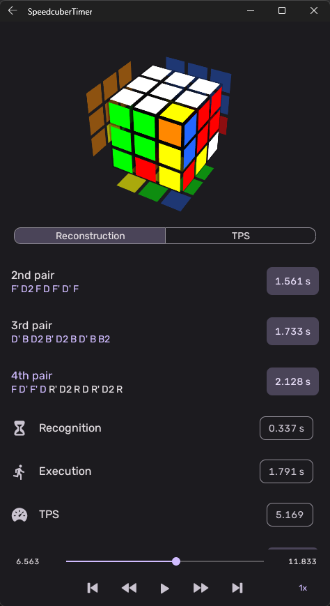

<div align="center">


# Speedcuber Timer

The smart, offline-ready speedcubing app made for speedcubers, by speedcubers.

Supports Android and iOS!

</div>

## Top Features

 - Connect to most brands of smartcubes *simultaneously*.
 - Automatic solve recordings and reconstructions.
 - Replay your smartcube-recorded solves to review and improve.
 - Support for all official events of the World Cube Association, and
   many common unofficial events!
 - All the statistics you know and love.
 - And much more!

<div align="center">


|            Connect to Smartcubes             |       Detailed Statistics        |
| :------------------------------------------: | :------------------------------: |
|  |  |


|             Automatic Reconstructions             |            Track Turn Speed            |
| :-----------------------------------------------: | :------------------------------------: |
|  |  |


</div>

## Contributing
Thank you for your interest in contributing to this project! There are
lots of ways you can do so:
 - [Sponsoring the developer](https://github.com/sponsors/jhale1805) to
   fund the app's continued presence on Google Play and bring it to the
   Apple App Store.
 - [Submitting feature
   requests](https://github.com/SpeedcuberOSS/BinaryClock/issues/new/choose).
 - [Reporting
   bugs](https://github.com/SpeedcuberOSS/BinaryClock/issues/new/choose).
 - Developing new features/bug fixes.
 - [Adding and updating translations](./src/localization/README.md).

See [CONTRIBUTING.md](CONTRIBUTING.md) for more information!

## The Legal Stuff

```
`speedcuber-timer` by Joseph Hale is licensed under the terms of the Mozilla
Public License, v 2.0, which are available at https://mozilla.org/MPL/2.0/.

You can download the source code for `speedcuber-timer` for free from
https://github.com/SpeedcuberOSS/speedcuber-timer.
```

### TL;DR

You can use files from this project in both open source and proprietary
applications, provided you include the above attribution. However, if
you modify any code in this project, or copy blocks of it into your own
code, you must publicly share the resulting files (note, not your whole
program) under the MPL-2.0. The best way to do this is via a Pull
Request back into this project.

If you have any other questions, you may also find Mozilla's [official
FAQ](https://www.mozilla.org/en-US/MPL/2.0/FAQ/) for the MPL-2.0 license
insightful.

If you dislike this license, you can contact me about negotiating a paid
contract with different terms.

**Disclaimer:** This TL;DR is just a summary. All legal questions
regarding usage of this project must be handled according to the
official terms specified in the `LICENSE` file.

### Why the MPL-2.0 license?

I believe that an open-source software license should ensure that code
can be used everywhere.

Strict copyleft licenses, like the GPL family of licenses, fail to
fulfill that vision because they only permit code to be used in other
GPL-licensed projects. Permissive licenses, like the MIT and Apache
licenses, allow code to be used everywhere but fail to prevent
proprietary or GPL-licensed projects from limiting access to any
improvements they make.

In contrast, the MPL-2.0 license allows code to be used in any software
project, while ensuring that any improvements remain available for
everyone.
