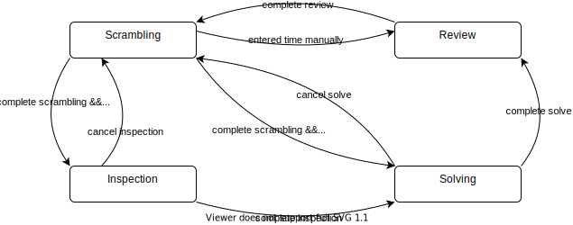
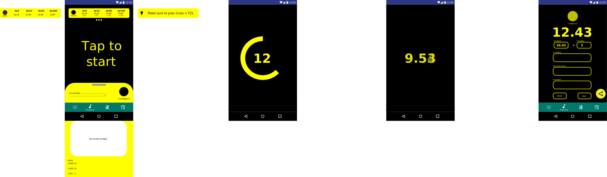

<!--
 Copyright (c) 2022 Joseph Hale <me@jhale.dev>

 This Source Code Form is subject to the terms of the Mozilla Public
 License, v. 2.0. If a copy of the MPL was not distributed with this
 file, You can obtain one at http://mozilla.org/MPL/2.0/.
-->

# Timer State Machine

Describes the different states of the timer page and the triggers that
move the timer between states.

## States

- **Scrambling:** The speedcuber is applying the given sequence of moves to
  the cube to prepare for an attempt.
- **Inspection:** The speedcuber is looking at the fully scrambled cube,
  planning his/her approach to the solution within a constrained time frame.
- **Solving:** The speedcuber is actively applying face turns to the cube to
  solve it.
- **Review:** The speedcuber has completed the solve and is noting any
  penalties/writing comments about the solve.

---

Other notes:

- Long press on **scrambling** to manually enter time (or add a setting
  to change the default mode)
